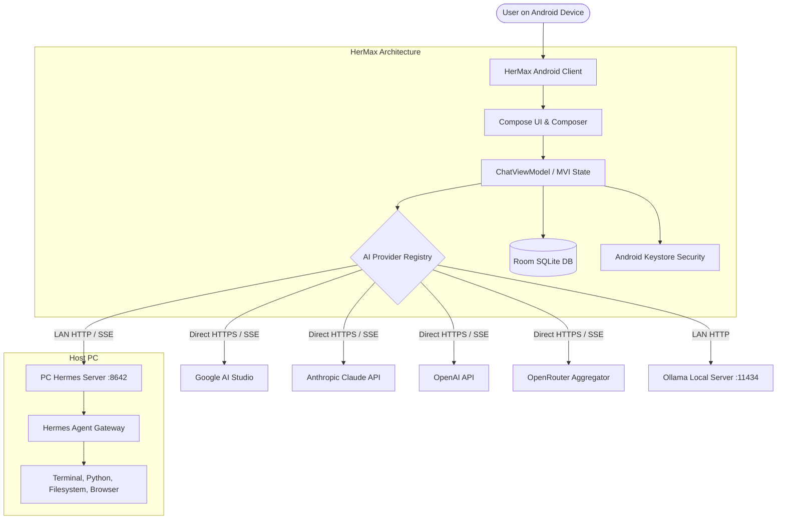

# 🚀 HerMax — Ultimate Android AI & Agent Client

<p align="center">
  
</p>

<p align="center">
  <b>A state-of-the-art Android AI client and agent orchestrator.</b><br>
  Interact seamlessly with your <b>Local Hermes Agent on your PC</b> or switch instantly to <b>Direct Cloud LLMs</b> (Google Gemini, Claude, OpenAI, OpenRouter, Ollama) on the go.
</p>

<p align="center">
  
  
  
  
  
</p>

---

## 📖 Table of Contents

- [Overview](#-overview)
- [Key Features](#-key-features)
- [System Architecture](#-system-architecture)
- [Screenshots & UI Showcase](#-screenshots--ui-showcase)
- [Quick Start & Installation](#-quick-start--installation)
  - [Prerequisites](#prerequisites)
  - [Building from Source](#building-from-source)
  - [Installing the APK](#installing-the-apk)
- [Server & Provider Configuration](#-server--provider-configuration)
  - [1. Local PC Hermes Agent Setup](#1-local-pc-hermes-agent-setup)
  - [2. Cloud AI Providers Setup](#2-cloud-ai-providers-setup)
- [How to Use HerMax](#-how-to-use-hermax)
  - [Conversations & Model Switching](#conversations--model-switching)
  - [File Attachments & Multimodal Analysis](#file-attachments--multimodal-analysis)
  - [Microphone & Voice Input](#microphone--voice-input)
  - [Agent Tool Approvals & Task Runs](#agent-tool-approvals--task-runs)
- [Feature Comparison Matrix](#-feature-comparison-matrix)
- [Tech Stack](#-tech-stack)
- [Troubleshooting & FAQ](#-troubleshooting--faq)
- [Technical Documentation](#-technical-documentation)

---

## 🌟 Overview

**HerMax** is a native Android AI client designed for power users, developers, and researchers. It bridges two worlds:
1. **Local Autonomous Agent:** Connects over Wi-Fi/LAN to your PC's **Hermes AI server**, letting your mobile device control terminal commands, run code, execute tools, approve security tasks, and browse files on your desktop.
2. **Direct Cloud AI Client:** When your PC is offline or you are away from home, HerMax connects directly to frontier cloud models (**Google Gemini 2.5 / 3.0, Anthropic Claude 3.7 / 3.5, OpenAI o1 / o3-mini / GPT-4o, OpenRouter, and Ollama**) without routing traffic through a third-party server.

---

## ✨ Key Features

- 💬 **ChatGPT-Grade Experience:** Ultra-responsive streaming responses, dynamic Markdown formatting, syntax-highlighted code blocks with one-tap copy, and smooth scrolling.
- ⚡ **Multi-Provider Switcher:** Switch between local Hermes and top cloud providers directly from the header dropdown or the full model explorer.
- 🧠 **Thinking & Reasoning Controls:** Fine-tune thinking levels (Off, Low, Medium, High) and response effort for reasoning models (o1, o3-mini, Gemini 2.5 Pro, Claude 3.7 Thinking).
- 📎 **Multimodal File Attachments:** Select PDFs, text files, code snippets, CSVs, JSON, and images. HerMax automatically uploads files to Hermes via multipart endpoints or formats them inline for cloud models.
- 🎙️ **Native Speech-to-Text:** Built-in Android `SpeechRecognizer` integration with live listening indicators. Transcribes your speech into the composer without auto-sending, allowing you to edit before submitting.
- 🛡️ **Zero-Trust Local Security:** API keys are encrypted on-device via **Android Keystore (AES-256-GCM)**. Cloud API keys are stored locally and never transmitted to your PC's Hermes server.
- 📋 **Human-in-the-Loop Agent Tools:** Inspect tool execution cards, view parameters, and tap to approve or reject sensitive terminal actions initiated by your Hermes Agent.
- 💾 **Smart Persistence:** Conversations only persist into History when you actually send a message. Empty chats never clutter your history drawer.

---

## 🏗 System Architecture



---

## 📱 Screenshots & UI Showcase

| 1. Server Connection | 2. Main Chat (New Chat) | 3. AI Providers | 4. Model Selector |
|:---:|:---:|:---:|:---:|
| <br>**Hermes LAN Setup**<br>Enter PC URL & API Token | <br>**Interactive Chat**<br>Model tags, Attachments & Mic | <br>**Provider Toggles**<br>Local PC, Gemini, Claude, OpenAI | <br>**Model Explorer**<br>Context window & capability tags |

- **Server Connection Screen:** Connect to your PC gateway (`http://<PC-IP>:8642`) with real-time ping/connection test and troubleshooting guide.
- **Active Chat Screen:** ChatGPT-like interface featuring suggestions, reasoning indicator, attachment chips, and inline model switcher.
- **AI Providers Screen:** Configure provider credentials independently with local AES-256 hardware encryption.
- **Model Selector Sheet:** Browse models by provider with tags for context length (`1048K ctx`, `131K ctx`), streaming status, and reasoning capability.

---

## 🚀 Quick Start & Installation

### Prerequisites

- Android 8.0 (API Level 26) or higher.
- JDK 17+ installed on your development machine.
- Android Studio Ladybug / Meerkat or Android SDK Command-line Tools.

### Building from Source

1. **Clone the repository:**
   ```bash
   git clone https://github.com/sliffer28/HerMax.git
   cd HerMax
   ```

2. **Build the Debug APK:**
   - On Windows (PowerShell):
     ```powershell
     .\gradlew.bat assembleDebug
     ```
   - On macOS / Linux:
     ```bash
     ./gradlew assembleDebug
     ```

3. **Locate the APK:**
   The output APK will be generated at:
   ```text
   app/build/outputs/apk/debug/app-debug.apk
   ```

### Installing the APK

- **Via ADB:**
  ```bash
  adb install -r app/build/outputs/apk/debug/app-debug.apk
  ```
- **Direct Sideload:** Copy `app-debug.apk` to your phone's internal storage and open it using any file manager to install.

---

## ⚙️ Server & Provider Configuration

### 1. Local PC Hermes Agent Setup

HerMax connects to your desktop Hermes agent over your local Wi-Fi network.

#### Step 1: Start Hermes on your PC
Make sure Hermes is installed on your PC. Enable LAN binding and start the gateway:
```bash
# Windows PowerShell
$env:API_SERVER_ENABLED="true"
$env:API_SERVER_PORT="8642"
$env:API_SERVER_HOST="0.0.0.0"       # Must be 0.0.0.0 for LAN access
$env:API_SERVER_KEY="your-secret-token"

hermes gateway
```

*(On Linux / macOS):*
```bash
export API_SERVER_ENABLED=true
export API_SERVER_PORT=8642
export API_SERVER_HOST=0.0.0.0
export API_SERVER_KEY=your-secret-token

hermes gateway
```

#### Step 2: Find your PC's IP Address
Run `ipconfig` (Windows) or `hostname -I` (Linux/macOS) in your terminal and note your IPv4 address (e.g., `192.168.1.50`).

#### Step 3: Configure Windows Firewall
Allow inbound connections to port 8642:
```powershell
netsh advfirewall firewall add rule name="Hermes API" dir=in action=allow protocol=TCP localport=8642
```

#### Step 4: Connect from HerMax
1. Open HerMax on your Android phone.
2. Open **Settings** (⚙️) → **Server Connection**.
3. Enter your Server URL: `http://192.168.1.50:8642`.
4. Enter your API Key: `your-secret-token`.
5. Tap **Test Connection** followed by **Save & Connect**.

---

### 2. Cloud AI Providers Setup

If you want to use frontier models without running your PC:

1. Open **Settings** → **AI Providers**.
2. Tap **Configure** under the provider you want:
   - **Google AI Studio:** Get an API key from [aistudio.google.com](https://aistudio.google.com/). Supports Gemini 2.5 Flash, 2.5 Pro, and Deep Research.
   - **OpenRouter:** Get a key from [openrouter.ai](https://openrouter.ai/). Access Qwen 2.5, Claude 3.7 Sonnet, DeepSeek R1, Llama 3.3.
   - **Anthropic / Claude:** Get a key from [console.anthropic.com](https://console.anthropic.com/).
   - **OpenAI:** Get a key from [platform.openai.com](https://platform.openai.com/).
   - **Ollama:** Enter your local or remote Ollama URL (e.g., `http://192.168.1.50:11434`).
3. Paste the key and tap **Verify & Save**.
4. The provider toggle switches to **Active** and its models instantly appear in the Model Selector.

---

## 💡 How to Use HerMax

### Conversations & Model Switching
- **Start a New Chat:** Tap the **+** button in the top bar or drawer. A draft is created immediately.
- **Model Switching:** Tap the model name in the top app bar or composer chip to open the inline model selector.
- **Thinking Effort:** Long-press or tap the settings icon inside the Model Selector to toggle Reasoning and set Thinking Level (Low / Medium / High).
- **History Drawer:** Tap the Menu icon (☰) to open previous chats. Chats are only saved after you send the first message, preventing blank entries.

### File Attachments & Multimodal Analysis
1. Tap the paperclip icon (📎) next to the message composer.
2. Select any file: **PDF, Images (JPG, PNG, WEBP), Code (.py, .kt, .js, .ts), TXT, CSV, JSON, XML**.
3. A preview chip appears above the input with the file name and formatted size.
4. Add multiple attachments or remove unwanted ones by tapping **✕**.
5. When using Hermes, files upload to `/v1/files`. When using Cloud LLMs, text files are automatically formatted into contextual code blocks for instant analysis.

### Microphone & Voice Input
1. Tap the microphone icon (🎙️) in the composer.
2. Allow microphone permission when prompted.
3. The mic button displays an active red recording pulse and a **Listening...** status banner.
4. Speak naturally. Once you finish or tap the mic button again, your speech is transcribed and inserted into the message box.
5. **HerMax does not auto-send speech**, allowing you to review, edit, or append text before pressing Send.

### Agent Tool Approvals & Task Runs
When connected to Hermes Agent:
- If an agent wants to run a sensitive command (e.g. `rm -rf`, editing files, modifying configurations), an **Approval Card** appears in the chat.
- Review the tool name, command details, and rationale.
- Tap **Approve** to execute or **Reject** to block.

---

## 📊 Feature Comparison Matrix

| Capability | Local Hermes Agent | Google AI Studio | OpenRouter | Anthropic Claude | OpenAI | Ollama |
|---|:---:|:---:|:---:|:---:|:---:|:---:|
| **Connection Type** | LAN / Wi-Fi | Cloud HTTPS | Cloud HTTPS | Cloud HTTPS | Cloud HTTPS | LAN / Cloud |
| **Tool Calling / Execution** | ✅ Full OS & PC | ❌ Chat Only | ❌ Chat Only | ❌ Chat Only | ❌ Chat Only | ❌ Chat Only |
| **Streaming Responses** | ✅ SSE | ✅ SSE | ✅ SSE | ✅ SSE | ✅ SSE | ✅ SSE |
| **Reasoning / Thinking Levels** | ✅ (Server model) | ✅ Gemini 2.5 Pro | ✅ DeepSeek R1 | ✅ Claude 3.7 | ✅ o1 / o3-mini | ✅ R1 / Qwen |
| **Multimodal Vision** | ⚠️ Model-dependent | ✅ Native | ✅ Supported | ✅ Supported | ✅ Native | ⚠️ Model-dependent |
| **Document/Code Ingestion** | ✅ Multipart API | ✅ Inlined text | ✅ Inlined text | ✅ Inlined text | ✅ Inlined text | ✅ Inlined text |
| **Works Offline from PC** | ❌ Requires PC | ✅ Yes | ✅ Yes | ✅ Yes | ✅ Yes | ❌ Requires PC |

---

## 🛠 Tech Stack

- **Language:** Kotlin 2.0
- **UI Framework:** Jetpack Compose with Material 3
- **Dependency Injection:** Dagger Hilt
- **Local Persistence:** Room Database (SQLite)
- **Networking:** OkHttp 4, Retrofit 2, Server-Sent Events (SSE)
- **Serialization:** Kotlinx Serialization JSON
- **Security:** AndroidX Security Crypto (EncryptedSharedPreferences with Android Keystore)
- **Speech Recognition:** Android `SpeechRecognizer` API
- **Document Handling:** Android Activity Result Contracts (`OpenMultipleDocuments`)

---

## ❓ Troubleshooting & FAQ

#### 1. "Not Connected" error when testing Hermes server connection
- **Check Wi-Fi:** Ensure your phone and PC are connected to the exact same Wi-Fi router / subnet.
- **Check Host Binding:** Make sure your PC's Hermes server was started with `API_SERVER_HOST=0.0.0.0` (not `127.0.0.1` or `localhost`).
- **Firewall Check:** Windows Firewall often blocks incoming port 8642. Run:
  ```powershell
  netsh advfirewall firewall add rule name="Hermes API" dir=in action=allow protocol=TCP localport=8642
  ```

#### 2. Speech recognition says "Speech recognizer is not available"
- Ensure Google Speech Services / Google app is installed and enabled on your device.
- Verify that microphone permission has been granted in Android Settings → Apps → HerMax → Permissions.

#### 3. How do I clear conversation history?
- Navigate to **Settings** (⚙️) → Scroll to **Storage** → Tap **Clear All Conversations**.

---

## 📚 Technical Documentation

Comprehensive documentation and architecture guides are available in the [`docs/`](./docs) directory:
- 📄 **[Complete Technical Documentation (PDF)](./docs/HERMAX_Complete_Technical_Documentation.pdf)** — Full architecture, security, and protocol whitepaper.
- 🌐 **[Interactive HTML Documentation](./docs/documentation.html)** — Visual guide and component overview.
- 🛠️ **[Implementation Guide](./docs/implementation.md)** — Detailed module and engineering reference.
- 💻 **[Local Hermes Agent Setup](./docs/local.md)** — Deep dive into local agent integration.
